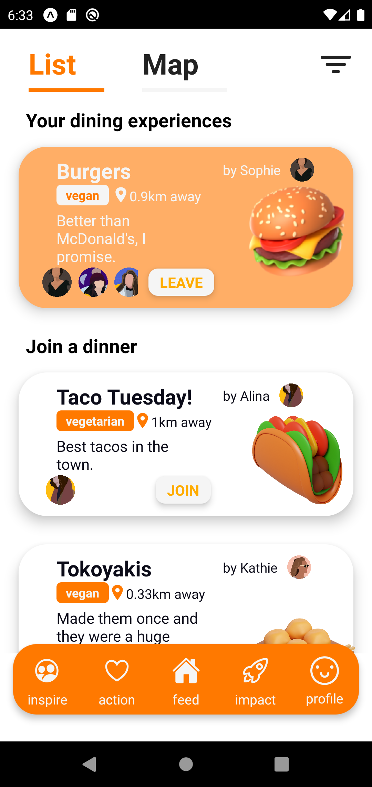
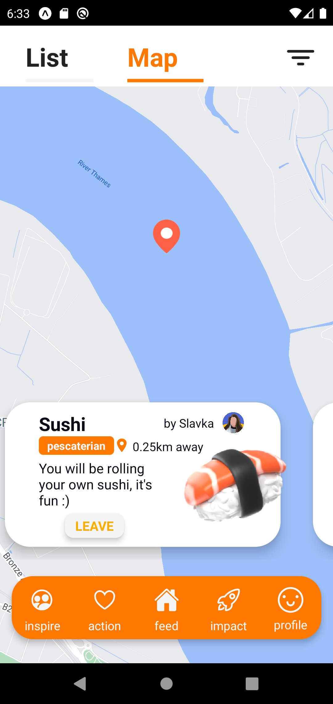
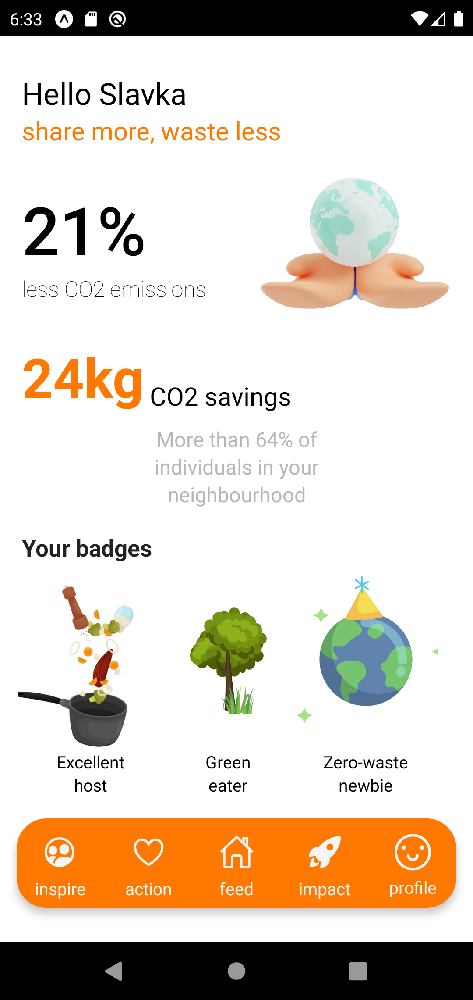
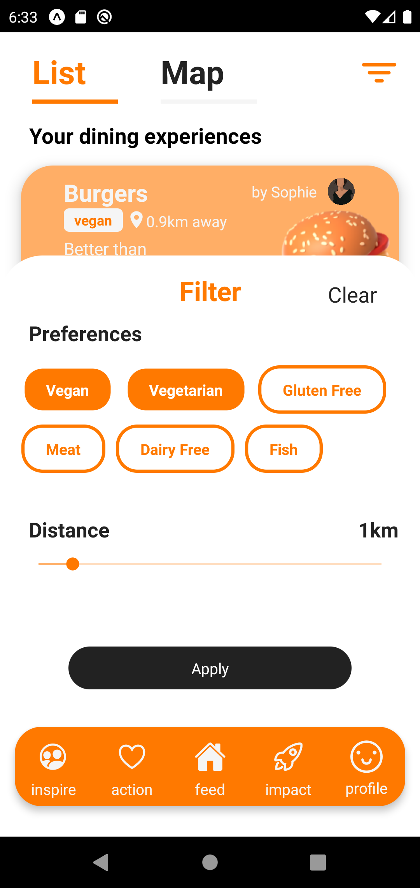
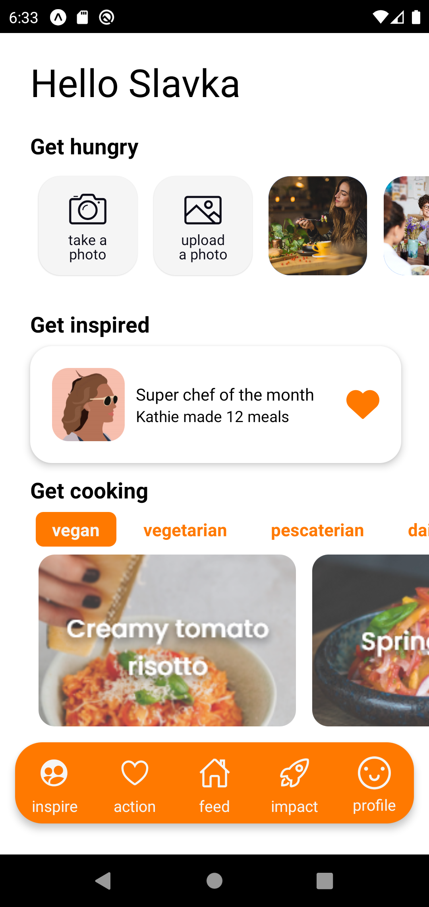
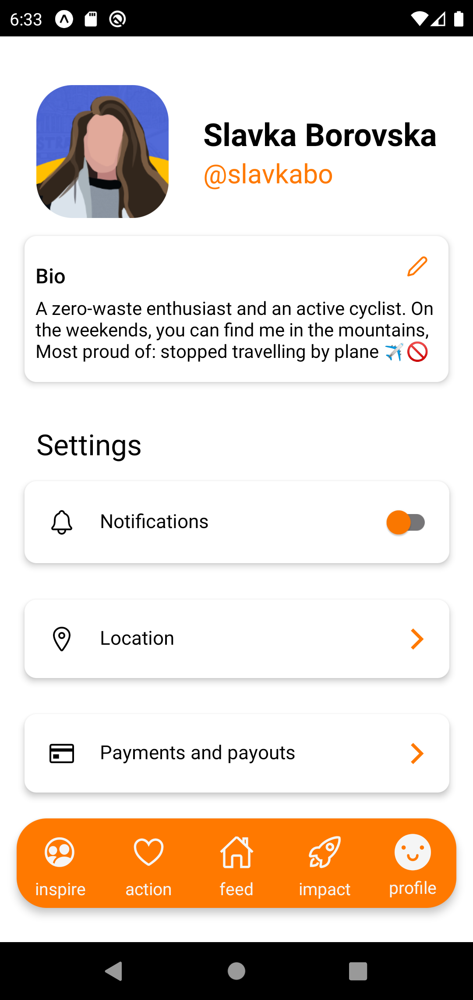

<h2>Foodme 🌱</h2>

<h3>This project was developed in the span of 36 hours as a submission during <a href="https://www.showcode.io/athena-hack/">Athena Hack</a> ⭐</h3>
 

 Foodme focuses on reducing household food waste through sharing meals and building communities in the process. 
15 million tonnes of food is wasted annually, with nearly half discarded within UK households. 
Foodme aims to offer a way to reduce that. 
 

<h2>Theme, tackled problems and our solution 💡</h2>
<b>Theme:</b> How can households reduce their carboon footprint? 
<b>Theme sponsor:</b> R2 Factory 
 

<b>❔ Our app tackles the following problems:</b>
<ul>

<li>
The need to reduce household-generated food waste
 </li>
<li>
The lack of sustainable options to eat out
 </li>
</ul>

 
<b>✨ Foodme solves the problems above by:</b>
<ul>

<li>
Achieving sustainability
through encouraging meal sharing
 </li>
<li>
Keeping motivation and
engagement through experiences
and comprehensive statistic
 </li>
<li>
Creating value and building
communities on a local level
 </li>
</ul>

 
 <h2>Technologies</h2>
<ul>
  <li>React Native</li>
  <li>Expo</li>
  <li>NodeJS</li>
 <li>multiple libraries</li>
</ul>  
     <h4>Design:</h4>

<ul>
  <li>AdobeXD</li>
  <li>Illustrator</li>
 <li>Photoshop</li>
</ul>  

<h2>Visuals</h2>

 
 
 
 
 
 
 
